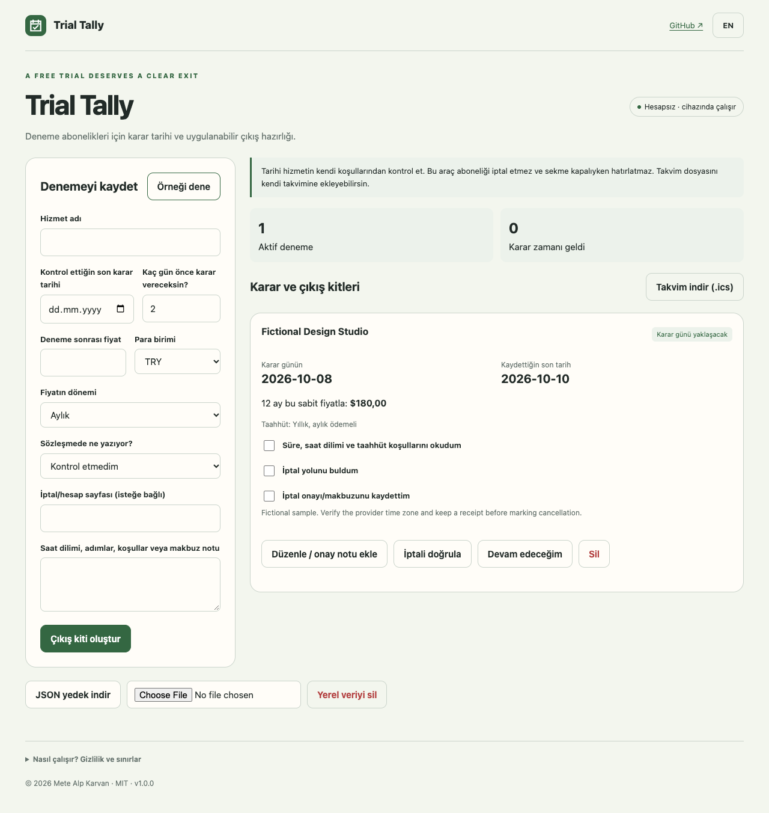

# Trial Tally

Deneme abonelikleri için karar tarihi ve uygulanabilir çıkış hazırlığı.

**[Uygulamayı aç](https://metealpkarvan.github.io/trial-tally/)** · [English](README.md) · [İndirilebilir ZIP](https://github.com/metealpkarvan/trial-tally/releases/latest)

## Nasıl kullanılır?

1. Hizmetin kendi koşullarından tarihi kontrol et; 0–30 gün önce bir karar günü belirle.
2. Fiyat dönemini ve taahhüt türünü ayrı kaydet. İptal bağlantısını, kesin saati/saat dilimini ve koşul notlarını ekle.
3. Koşullar, iptal yolu ve onay/makbuz kontrol listesini kullan.
4. ICS dosyasını kendi takvimine aktar; her aktif deneme için karar ve son tarih etkinliği içerir.
5. İptal onayını kaydedip not ekledikten sonra iptali doğrula veya devam etmeyi seç. Uygulama iptal işlemini yapmaz.

EN/TR düğmesi dili değiştirir. Örnek düğmesi kurgusal veriler yükler. İlk başarılı çevrimiçi açılıştan sonra uygulama dosyaları aynı tarayıcıda çevrimdışı kullanım için önbelleğe alınır.

## İndir ve yerelde çalıştır

Canlı demo için hesap veya kurulum gerekmez. Releases bölümündeki **trial-tally-v1.0.0.zip** dosyasını indir, çıkar ve çıkarılan klasörde çalıştır:

    python3 -m http.server 8080 --bind 127.0.0.1

Tarayıcıda http://127.0.0.1:8080 adresini aç. Modül kısıtlamaları nedeniyle HTML dosyasına çift tıklamak yerine yerel HTTP sunucusu kullanılır. ZIP, kullanıcı kayıtlarını içermez.

## Gizlilik ve sınırlar

Uygulama cihazında çalışır. AI API anahtarı, sunucuya metin yükleme, reklam, analiz veya hesap gerektirmez. Kayıtlar bu tarayıcının yerel deposundadır. JSON yedekleri şifresizdir; önemli kayıtlar için yedek indir. İçe aktarma mevcut kayıtları değiştirmeden önce doğrulama ve onay ister.

Otomatik iptal ve arka plan bildirimi yoktur. Tarihler gün bazındadır; kesin son saat ve saat dilimi ayrıca kontrol edilmelidir. Takvim alarmı davranışı uygulamana bağlıdır. Vergi veya iptal bedeli hesaplanmaz.

## Araştırma ve geliştirme

Dayanılan paylaşım: [Deceptive Patterns (@darkpatterns)](https://x.com/darkpatterns/status/1489901640777973768) (2022-02-05). X erişim sınırlaması nedeniyle [okunabilir thread kopyası](https://threadreaderapp.com/thread/1489901640777973768.html) da incelendi. Bu seçilmiş küçük bir keşif örneklemidir; pazar araştırması veya ölçülmüş başarı iddiası değildir. Gözlem ile ürün çıkarımı [araştırma notlarında](docs/RESEARCH.md) ayrılır.

Geliştirme için Node.js 22+ gerekir:

    npm test
    npm run build

Testler, mimari tercihler ve kullanım kontrolleri İngilizce teknik belgelerde açıklanır. MIT lisansıyla kullanabilir, değiştirebilir ve katkıda bulunabilirsin.
